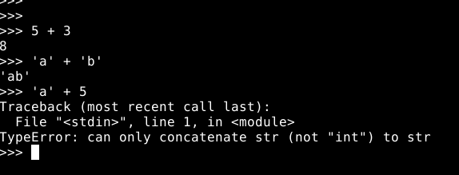
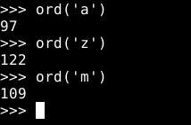
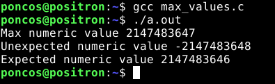
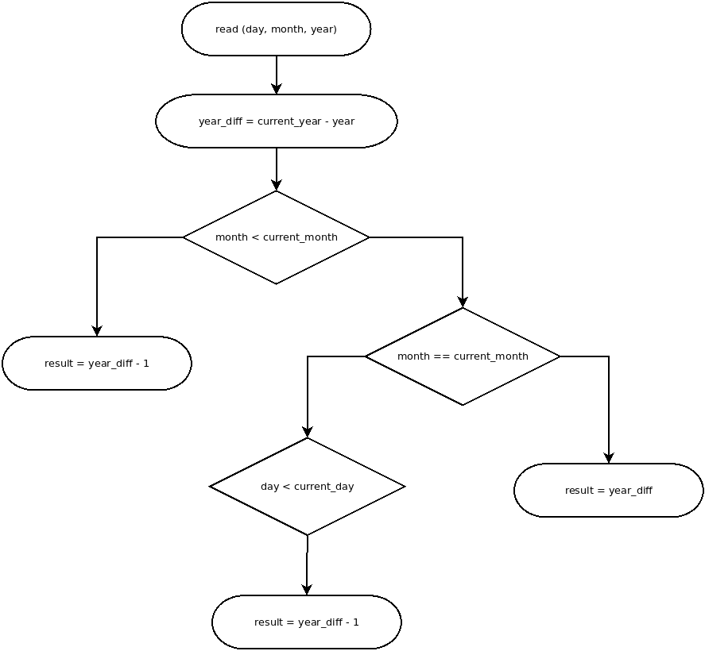
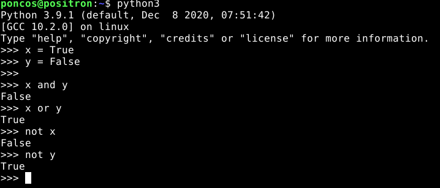

# Introduction to Programming


## Basic concepts

### Types and Objects

Every programming language has the concept of *types* of data, like numerical or scalar types, alphanumeric or strings type.

In Python we will talk of **object** and types instead of data and types. Basically things like numbers and strings are objects in Python
and each object has a type which is important because it will tell us the kind of operations we can do with that object.

The different basic types available in Python are:

- Integer
- Float
- Bool
- String 

It is important the reader understand that although the basic data types are similar in any programming language they
do can vary from one language to another. For example in the C programming language these are the basic data types.

- int
- long
- float
- double
- char
- bool


### Expression

A expression is defined as any unit or entity of code that can be evaluated to determine the expression value.

A basic classification is to devide the types of expressions in two categories: 1) Assignment, those expressions that assign
a value to a variable, and 2) those expressions that simply has a value. In the following examples, the first two expressions
belong to the second category, and the third one to the first category. 

- 5 + 3. This expression is a Integer expression because its value is a *intiger*.
- 5.0 + 3.0. This is a *float* expression.
- 5 < 10. Relational expression which evaluates to a *boolean* value, in this case *True*.

There are as well, **boolean expression** that evaluate to a *bool* value, and **string expressions**.

Operators behaviour depends on the types they are applied to, for example for the expression *5 + 3* the operator *+* is
the usual sum witch is evaluated to 8, but for other data types could behave different or even fail because the operator 
might not be defined for the data types being used.



The previous image is an example (making use of the Python command line interpreter) of how operators behave different
for different data types. The second expression in the image shows the operator '+' used with two string arguments, and the
outcome is the two strings concatenated. The last expression results in a error, because the operator '+' does not
work with one argument being a *string* and another one being an *integer*.

### Statements

A statement is a single unit in the programming language. A statement can have structure with
internal components like expression. For example two types of simple expression that will see later
are:

- **Assignment**. *x = 5 + 1*
- **Return**. *return x+5*
- **Conditionals**. "if x < 10 then print('hello')" 

There are more types of expression that will see in this article but for now we only need to understand
the concept, and understand that **a program is a sequence of statements**.

### Variables

A variable is like a label, a label pointing to a value or a object using Python terminology.

```python
pi = 3.14
radius = 20
area = pi * (radius**2)

print(area)
```

In the example above, we have assigned the value 39 to the variable called *area*, and then we have made use of that
variable using the Python function *print* to show the value of that variable in the screen.

The action of assign a variable to an object is called **binding**, we are binding the variable or the name or
the label *pi* to the object *3.14*, which in reality will be placed in a memory position in the computer. Basically
the variables contain the **memory address** of the object, that is the memory position where the object is located.

The reasons to use variables is clear but let's mention them.

- **Code re-use**. In the example above, the expression 'pi * (radius**2)' is executed once and the result is stored in 
the variable *area*, therefore later in the code we can use it as many times as we need without having to execute the same
expression again. For example in the *print* operation, we just use the value pre-calculated available in the variable value.

- **Self-documented code**.

#### Data type encoding and precision

It is important to understand that in the end, data types are sequence of bits (0 and 1 symbols) located in the computer memory, and
in that sense there is no difference between numeric, alphanumeric or any other data type. The only difference is
the how the program interprets the information.

For example, a character variable is represented as a sequence of bits and then the value is interpreted according to
standards like [ASCII](https://en.wikipedia.org/wiki/ASCII), [UTF-8](https://en.wikipedia.org/wiki/UTF-8) or 
[UTF-16](https://en.wikipedia.org/wiki/UTF-16#UTF-16BE). For example, according to the ASCII standard, the lower case
characters from *'a'* to *'z'* are encoded with the numeric values from *97* to *122*. This can be easily testd in Python
using the bult-in function **ord(<character>)** which for a given character returns the corresponding numerical value.

   
   

This is called **encoding**, to the fact of using a type of mapping to represent a set of characters. In this case, the mapping
is from a sequence of bits (numeric values) to a set of alphanumerical characters.

In the case of characters, the maximum number of bits used for the encoding is important because it tell us the maximum number
of characters that will be represented. For example, the encoding UTF-16, which is common nowadays uses a longer sequence of 
bits (16 bits which is two bytes) in contrast to the 8 bits (1 byte) used by the ASCII standard.

In the case of numeric values, the number of bits is important because it will give us the maximum value we can represent. For
example if we only used two bits for a variable the maximum value would be 4 in decimal (2 to the power of 2). In Python the 
programmer do not have to worry about this, because the *Integer* type is dynamic in the sense that can increase the number
of bits as needed, but in other languages like *C* it is not like that, and that is why there are different types of numeric values.

The value range supported by the different numerical types is important, and the programmer must take it into account or
strange things might happen in the program execution. As indicated above, in *C* the maximum number of digits used to
represent a numerical value is fixed, and that implies there is a fixed maximum value for each particular data type.

Type   | Storage Size | Value Range
---    | ---          | ---
int    | 4 bytes      | -2,147,483,648 to 2,147,483,647
long   | 8 bytes      | -9223372036854775808 to 9223372036854775807
float  | 4 bytes      | 1.2E-38 to 3.4E+38
double | 8 byte       | 2.3E-308 to 1.7E+308
char   | 1 byte       | 0 to 255


As an example of why the programmer should have in mind these restrictions, the following program can be a good explanation.
If we compile the program using the command **gcc** an then we execute it as depicted in the screenshot, immediately there is
something strange with the second line printed in the console. Looking at the source code, the variable *unexpected_numeric_value*
is assigned the value *max_numeric_value + 1*, but the value printed in the console is a very negative value. This is called
**[integer overflow](https://en.wikipedia.org/wiki/Integer_overflow)**, we are assigning a value to a variable of type *int* which
 is outside of the range allowed by the number of digits used for that data type.

```c
#include<stdio.h>
#include<limits.h>

int main(int argc, char** argv) {

	int max_numeric_value = INT_MAX;

	int unexpected_numeric_value = max_numeric_value + 1;

	int expected_numeric_value = max_numeric_value - 1;

	printf("Max numeric value %d\n", max_numeric_value);

	printf("Unexpected numeric value %d\n", unexpected_numeric_value);

	printf("Expected numeric value %d\n", expected_numeric_value);
}
```




## Branching Programming


With the concepts we have seen so far we can make programs made of a list of statements and they will be executed
one after another in the same order as they are written. This is a good start, but any
realistic program, at some point will need to make some kind of decision to execute one sentence or another. 

Conditional statements are based on the *if-then* or *if-then-else* block, what they do is to evaluate
a condition given by the programmer and if the condition evaluates to *True* the *then* block is executed. If
the evaluation is *False* and there is a *else* block this will be executed.

```
If <logical_expression> Then
    <statements>
Else
    <statements>
End If
```

```python
age = 18
if age > 18:
    print("Your are older than eighteen")
else:
    print("Your are NOT older than eighteen")
```


```python
age = 18
if age > 18:
    print("Your are older than eighteen")
```

the expression inmediately after the *if* keyword is a logical expression which evalues to a boolean value 
(True or False), and if the result of this expression is *True* the block of statements between the 
*if* and *else* keywords are executed, otherwise if the logical expression evalutes to *False* the
block of statements after the *else* keyword are executed (if there is a *else* block).  


Logical Operator    | Description
---                 | ---
==                  | 
<                   |
>                   |
!=                  |
<=                  |
>=                  |




```python
from datetime import date

day = int(input("Please enter the day you were born? "))
month = int(input("Please enter the month you were born? "))
year = int(input("Please enter the year you were born? "))

now = date.today()
current_year = now.year
current_day = now.day
current_month = now.month

year_diff = current_year - year

if current_month < month:
    age = year_diff -1
else:
    if current_month > month:
        age = year_diff
    else:
        if current_day < day:
            age = year_diff - 1
        else:
            age = year_diff

print("Your age is " + str(age) + " years old.")
```

### ELSE IF block

```python
from datetime import date

day = int(input("Please enter the day you were born? "))
month = int(input("Please enter the month you were born? "))
year = int(input("Please enter the year you were born? "))

now = date.today()
current_year = now.year
current_day = now.day
current_month = now.month

year_diff = current_year - year

if current_month > month:
    age = year_diff
elif current_month < month:
    age = year_diff -1
elif current_day < day:
    age = year_diff - 1
else:
    age = year_diff

print("Your age is " + str(age) + " years old.")
```

### Boolean Logic

Boolean logic is the branch of Algebra responsible to study systems based on variables which can only
take two posible values, *truth value* or and *false value* (True and False). It is extensively used
in digital electronics (where the only two logical values a signal can take are zero and one), and in
programming where it is use to control the execution flow.

There are three basic operations used in boolean logic. 

Logic Operation     | Expression        | Description
---                 | ---               | ---       
AND                 | x and y           | True only if both variables are True
OR                  | x or y            | True if one of the variable is true or both
NOT                 | not x             | True if the variable False, and False if the variable is True

To understand better what is the logic operations output for all the possible combination of the variables
values the **truth tables** are used, as it is shown in the following table where zero means false, and 1 means true.

x   | y     | x AND y   | x OR y
--- | ---   | ---       | ---
0   | 0     | 0         | 0
1   | 0     | 0         | 1
0   | 1     | 0         | 1
1   | 1     | 1         | 1


x   | NOT x 
--- | ---       
0   | 1
1   | 0
 




## Iterations


## Basic data structures


### Arrays

### Matrices


### Dictionaries


### Functions  
